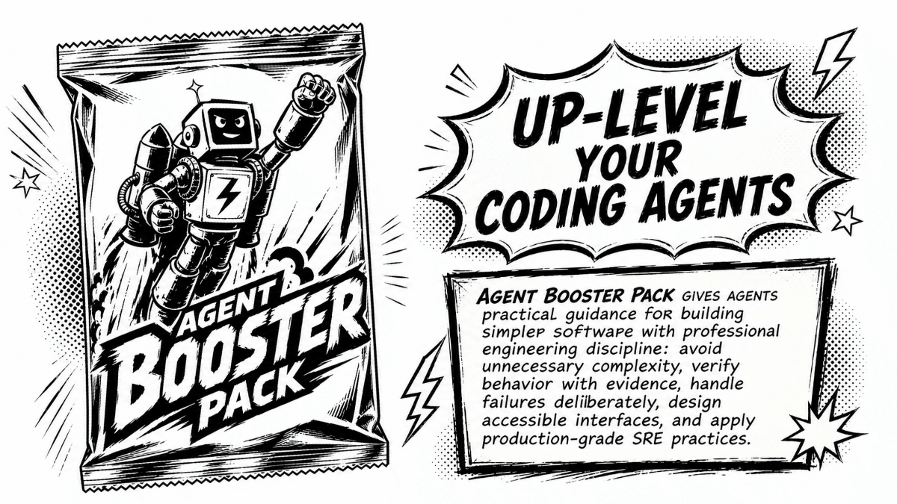

# Agent Booster Pack

<p align="center">
  
</p>

A portable set of high-leverage, general-purpose skills for leveling up coding
agents, with strong defaults for building, changing, testing, reviewing, and
operating web applications and services.

Agent Booster Pack distills 25 years of software engineering experience, from
startups to large private and public sector organizations, into portable skills
for Codex, Claude Code, and other agents that understand the Agent Skills
layout. It raises engineering maturity by pushing agents toward simpler designs,
explicit data models, proven behavior, safer production systems, intuitive and
accessible interfaces, and clear, scoped changes a human can review and
maintain.

In practice, that means:

- Get the data model right first: make values, states, and invariants explicit,
  limit side effects, and push state changes to the boundaries.
- Replace "looks right" with proof from tests, contracts, logs, and
  caller-visible checks.
- Plan past launch and harden beyond the MVP: observability, reliability,
  deployment safety, and rollback planning.
- Treat security, data safety, and accessibility as engineering requirements,
  not optional polish.
- Debug and change code from the root cause, not the symptom.
- Package work into scoped, reviewable changes a human can trust and maintain.

## Install

Prerequisites:

- Git.
- GNU Stow.

Install Stow if needed:

```sh
# macOS
brew install stow

# Debian / Ubuntu
sudo apt install stow

# Fedora
sudo dnf install stow
```

Fresh checkout and install:

```sh
git clone https://github.com/kreek/agent-booster-pack.git
cd agent-booster-pack
stow agents
./setup.sh
```

`stow agents` is the main install step. It links the repo's `agents/` package
into your home directory:

- `~/AGENTS.md`
- `~/.agents/skills/`
- `~/.agents/commands/`
- `~/.claude/CLAUDE.md`

`./setup.sh` is the compatibility step. It does not install Stow, clone the
repo, or merge instruction files. It adds tool-specific symlinks for agents that
do not rely only on `~/.agents/skills/`:

- `~/.claude/skills/` points at `~/.agents/skills/`
- `~/.codex/skills/<name>/` links each portable skill individually
- `~/.codeium/windsurf/skills/<name>/` links each skill when Windsurf is present
- `~/.claude/commands/<name>.md` links command prompts
- `~/.codex/prompts/<name>.md` is kept for legacy Codex prompt-command support

It also keeps the in-repo Claude Code plugin (`plugin/`) in sync with the
source-of-truth skills, so `/abp:<skill>` slash commands always reflect the
current pack.

## Install for Claude Code (namespaced)

The flat `~/.claude/skills/` symlink above gives Claude Code unprefixed slash
commands like `/frontend` and `/security`. To get the same behaviour Codex
already uses (`ABP:` prefix), install ABP as a Claude Code plugin instead:

```sh
# Inside Claude Code:
/plugin marketplace add kreek/agent-booster-pack
/plugin install abp@abp
```

Slash commands then namespace as `/abp:frontend`, `/abp:security`, `/abp:tests`,
etc. — the prefix protects against name clashes with built-in or third-party
plugin skills.

For local development against a working tree, point `/plugin install` at the
repo's `plugin/` directory:

```sh
/plugin install /path/to/agent-booster-pack/plugin
```

After installing the plugin, drop the legacy whole-directory symlink if you want
only the namespaced commands and no duplicates:

```sh
rm ~/.claude/skills        # only if it is a symlink to ~/.agents/skills
```

The plugin and the flat symlink can coexist — they will simply both appear in
`/help` listings, prefixed and unprefixed respectively.

`stow agents` does not merge files. If `~/AGENTS.md` already exists as a real
file, Stow will report a conflict instead of appending the Agent Booster Pack
instructions. Do not use `stow --adopt` unless you intentionally want Stow to
take ownership of that file.

For an existing personal `~/AGENTS.md`, merge deliberately:

1. Keep any personal or workplace-specific rules that are still current.
2. Add the skill index and priority rules from `agents/AGENTS.md`.
3. Preserve the ABP rule that local project `AGENTS.md` files are additive and
   more specific, but must not weaken safety, proof, validation, or
   user-change-preservation requirements.
4. Run `stow --ignore='^AGENTS\.md$' agents` so `~/.agents/skills/`,
   `~/.agents/commands/`, and `~/.claude/CLAUDE.md` are still linked while your
   existing `~/AGENTS.md` remains manually maintained.
5. Run `./setup.sh` so tool-specific compatibility links are created from those
   shared `~/.agents` links.

Codex now discovers skills directly from `.agents/skills` / `~/.agents/skills`;
do not rely on `~/.codex/prompts` for slash commands in current Codex CLI.

GitHub Copilot CLI, Pi, Cursor, Gemini CLI, and OpenCode auto-discover from
`~/.agents/skills/`, so the `stow agents` link is enough — no extra `setup.sh`
wiring needed. Copilot also scans `~/.copilot/skills` and `~/.claude/skills`;
the pack deliberately leaves `~/.copilot/skills` unlinked so skills are not
registered twice. For project-scoped Copilot skills, drop a `.github/skills/`,
`.claude/skills/`, or `.agents/skills/` directory in the repo itself.

## Skill System

Skills are progressive context: agents see only `name` and `description` until a
task triggers a skill, then load the matching `SKILL.md` for the sharper rule,
workflow, and proof check needed for the work in front of them.

The skill pack is deliberately not a checklist library. It is a set of
discipline-enforcing lenses, grouped by the kind of engineering pressure they
apply:

### Foundational design

- [`data`][skill-data]: data shapes, state transitions, invariants, effects, and
  module boundaries.
- [`proof`][skill-proof]: explicit proof obligations for behavior, contracts,
  invariants, root causes, and refactor safety.

### Correctness and change

- [`review`][skill-review]: risk-focused review of diffs, branches, PRs,
  requested changes, and agent-generated code.
- [`tests`][skill-tests]: behavior-focused tests that prove caller-visible
  contracts without overspecifying implementation.
- [`debugging`][skill-debugging]: root-cause investigation for bugs, flakes,
  regressions, and unexplained symptoms.
- [`refactoring`][skill-refactoring]: structure changes that preserve behavior
  while improving clarity or migration paths.
- [`error-handling`][skill-error-handling]: error types, propagation, retries,
  recovery, crash boundaries, and user-facing messages.

### Safety gates

- [`security`][skill-security]: authentication, authorization, secrets,
  cryptography, input validation, and trust boundaries.
- [`database`][skill-database]: schemas, migrations, indexes, queries,
  transactions, deletion semantics, and production data access.
- [`deployment`][skill-deployment]: CI/CD, rollout strategy, rollback paths,
  feature flags, and deploy-time coordination.
- [`resilience`][skill-resilience]: remote calls, timeouts, retries,
  idempotency, consistency, sagas, and outbox patterns.

### Production quality

- [`observability`][skill-observability]: logs, metrics, traces, health checks,
  dashboards, SLOs, alerts, and telemetry quality.
- [`realtime`][skill-realtime]: event streams, live updates, pub/sub,
  subscriptions, delivery guarantees, ordering, and replay.
- [`concurrency`][skill-concurrency]: async, threads, actors, channels, locks,
  cancellation, queues, and backpressure.
- [`performance`][skill-performance]: latency, throughput, p99s, CPU, memory,
  allocations, I/O, and resource saturation.
- [`cache`][skill-cache]: cache strategy, invalidation, stampede prevention,
  Redis, Memcached, CDNs, and stale data.

### Public/user surfaces

- [`api`][skill-api]: HTTP APIs, OpenAPI, status codes, pagination, idempotency,
  rate limits, versioning, and webhooks.
- [`docs`][skill-docs]: READMEs, ADRs, runbooks, reference docs, tutorials, and
  explanatory comments.
- [`frontend`][skill-frontend]: pages, components, interaction flows, responsive
  layout, visual design, and component states.
- [`accessibility`][skill-accessibility]: WCAG, semantic HTML, ARIA, keyboard
  navigation, focus, contrast, forms, and inclusive UI.

### Project and repo workflow

- [`git`][skill-git]: rebases, conflict resolution, bisects, history recovery,
  branch cleanup, and PR history.
- [`commit`][skill-commit]: working-tree grouping, commit splits, concise commit
  messages, and approved commits.
- [`scaffolding`][skill-scaffolding]: new projects, baseline tooling,
  package-manager defaults, test runners, linting, and CI. It includes
  opinionated defaults for TypeScript APIs on Cloudflare Workers with Hono,
  larger frontend apps with SvelteKit, quick-to-build typed Python APIs with
  FastAPI and the Python ecosystem, or high-performance web services with Go and
  Fiber or Rust and Axum.

[skill-accessibility]: agents/.agents/skills/accessibility/SKILL.md
[skill-api]: agents/.agents/skills/api/SKILL.md
[skill-cache]: agents/.agents/skills/cache/SKILL.md
[skill-commit]: agents/.agents/skills/commit/SKILL.md
[skill-concurrency]: agents/.agents/skills/concurrency/SKILL.md
[skill-data]: agents/.agents/skills/data/SKILL.md
[skill-database]: agents/.agents/skills/database/SKILL.md
[skill-debugging]: agents/.agents/skills/debugging/SKILL.md
[skill-deployment]: agents/.agents/skills/deployment/SKILL.md
[skill-docs]: agents/.agents/skills/docs/SKILL.md
[skill-error-handling]: agents/.agents/skills/error-handling/SKILL.md
[skill-frontend]: agents/.agents/skills/frontend/SKILL.md
[skill-git]: agents/.agents/skills/git/SKILL.md
[skill-observability]: agents/.agents/skills/observability/SKILL.md
[skill-performance]: agents/.agents/skills/performance/SKILL.md
[skill-proof]: agents/.agents/skills/proof/SKILL.md
[skill-realtime]: agents/.agents/skills/realtime/SKILL.md
[skill-refactoring]: agents/.agents/skills/refactoring/SKILL.md
[skill-resilience]: agents/.agents/skills/resilience/SKILL.md
[skill-review]: agents/.agents/skills/review/SKILL.md
[skill-scaffolding]: agents/.agents/skills/scaffolding/SKILL.md
[skill-security]: agents/.agents/skills/security/SKILL.md
[skill-tests]: agents/.agents/skills/tests/SKILL.md

## Authoring Rules

Every skill should be short, directive, portable, and hard to skip:

- Use portable frontmatter: `name` plus a trigger-focused `description`.
- Put discriminating trigger words in the description; the body loads only after
  the skill triggers.
- State one Iron Law near the top when the skill has a non-negotiable rule.
- Include `When to Use` and `When NOT to Use` so neighboring skills do not blur
  together.
- Use imperative workflow steps; do not write background essays.
- Require evidence in `Verification`; unchecked proof obligations mean the work
  is reported as unproven.
- Use `Handoffs` to route to neighboring skills instead of duplicating their
  bodies.
- Put deterministic or fragile checks in `scripts/` so agents run them instead
  of re-deriving them.
- Put deeper reference material in `references/`; keep each referenced file one
  hop from `SKILL.md`.
- Delete stale or duplicative prose instead of preserving it as "context."

## Maintenance

After adding or renaming a skill:

```sh
./setup.sh
```

This reruns the per-agent symlink fan-out and the plugin sync (so
`plugin/skills/<new-name>` is created and stale links are pruned). The
`scripts/validate-skill-anatomy.sh` script enforces the same drift check, so a
plugin out of sync with `agents/.agents/skills/` will fail validation.

Then update:

- `agents/AGENTS.md` so agents can route to it
- this README so humans understand the pack
- any neighboring skills' handoffs when routing changes

Run the markdown check before publishing broad doc updates:

```sh
pnpm format:check
```

Use `pnpm format` only when you intend to rewrite all markdown formatting in the
repo.

## Remove

```sh
stow -D agents
```

Manual cleanup may still be needed for tool-specific symlinks under
`~/.claude/skills/`, `~/.codex/skills/`, `~/.codeium/windsurf/skills/`,
`~/.claude/commands/`, and `~/.codex/prompts/`. If you installed the Claude Code
plugin, also run `/plugin uninstall abp@abp` and (optionally)
`/plugin marketplace remove abp` from inside Claude Code.
