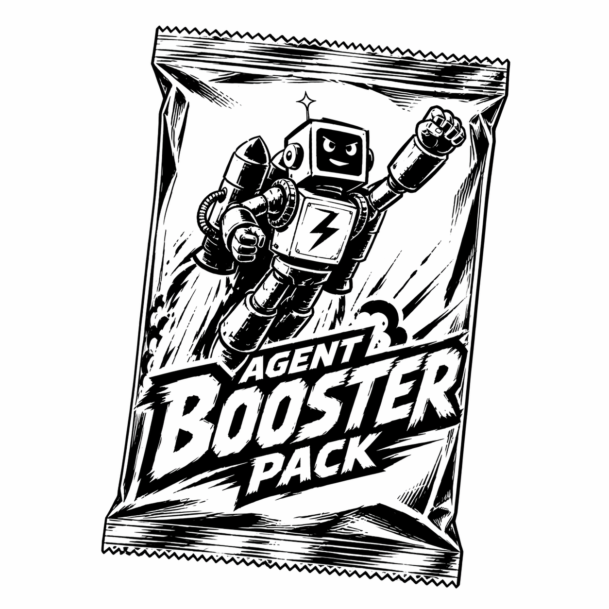

# Agent Booster Pack



A portable set of high-leverage skills for leveling up coding agents.

This is my brain dump of over 25 years of software development: the habits,
standards, and hard-won lessons I accumulated working in startup environments
through large private and public sector organizations. It reflects the full
gamut: doing everything under the sun at a startup, through focused API
governance, to leading SRE teams at large organizations and guiding multiple
teams toward better engineering practices.

This is my source of truth for how coding agents should reason, change code,
prove correctness, and package work across Codex, Claude Code, and other agents
that understand the Agent Skills layout. Since skills were introduced, I have
documented and categorized each recurring correction I made to a model and
turned those interventions into guidance for how agents should approach the next
similar task. I also audited the skills libraries I found and did not find many
that focused on increasing the engineering maturity or code quality of what
agents produced, so I made my own.

Complexity is death for any software project. Rich Hickey's [“Simple Made
Easy”][simple-made-easy] is the best talk I have heard on software engineering,
and its philosophy, along with other [data-first functional best
practices][skill-data] (even when working in OOP-heavy languages), is the
baseline for this set of skills. I have also learned from experience and
research that agents produce their best results when pushed toward simplicity
and required to prove their work rather than just claim completion.

<br clear="left">

In practice, that means:

- Model values, states, invariants, and effects before picking abstractions.
- Turn every meaningful engineering claim into evidence.
- Prove behavior through the boundary a real caller uses.
- Let security, data loss, deploy risk, and production reliability outrank style
  and local habit.
- Keep changes small: one root cause, one logical behavior, one clean commit.

## Repository Shape

- `agents/AGENTS.md` is the global instruction file and skill index.
- `agents/.agents/skills/` contains portable skills for engineering judgment,
  proof obligations, testing, safety, production quality, UX, and workflow.
- `agents/.agents/commands/` contains cross-agent command prompts where a tool
  still supports command fan-out.
- `agents/.claude/CLAUDE.md` is a thin Claude Code wrapper around `AGENTS.md`.
- `plugin/` is the Claude Code plugin packaging — its `skills/` and `commands/`
  are symlinks back to `agents/.agents/`, so installing the plugin namespaces
  every skill as `/abp:<name>`.
- `.claude-plugin/marketplace.json` advertises the plugin so users can
  `/plugin marketplace add` this repo directly.
- `setup.sh` wires skills and commands into tool-specific locations and keeps
  the plugin's symlinks in sync.

## Install

Prerequisites:

- Git.
- GNU Stow.

Install Stow if needed:

```sh
# macOS
brew install stow

# Debian / Ubuntu
sudo apt install stow

# Fedora
sudo dnf install stow
```

Fresh checkout and install:

```sh
git clone https://github.com/kreek/agent-booster-pack.git
cd agent-booster-pack
stow agents
./setup.sh
```

`stow agents` is the main install step. It links the repo's `agents/` package
into your home directory:

- `~/AGENTS.md`
- `~/.agents/skills/`
- `~/.agents/commands/`
- `~/.claude/CLAUDE.md`

`./setup.sh` is the compatibility step. It does not install Stow, clone the
repo, or merge instruction files. It adds tool-specific symlinks for agents that
do not rely only on `~/.agents/skills/`:

- `~/.claude/skills/` points at `~/.agents/skills/`
- `~/.codex/skills/<name>/` links each portable skill individually
- `~/.codeium/windsurf/skills/<name>/` links each skill when Windsurf is present
- `~/.claude/commands/<name>.md` links command prompts
- `~/.codex/prompts/<name>.md` is kept for legacy Codex prompt-command support

It also keeps the in-repo Claude Code plugin (`plugin/`) in sync with the
source-of-truth skills, so `/abp:<skill>` slash commands always reflect the
current pack.

## Install for Claude Code (namespaced)

The flat `~/.claude/skills/` symlink above gives Claude Code unprefixed slash
commands like `/frontend` and `/security`. To get the same behaviour Codex
already uses (`ABP:` prefix), install ABP as a Claude Code plugin instead:

```sh
# Inside Claude Code:
/plugin marketplace add kreek/agent-booster-pack
/plugin install abp@abp
```

Slash commands then namespace as `/abp:frontend`, `/abp:security`, `/abp:tests`,
etc. — the prefix protects against name clashes with built-in or third-party
plugin skills.

For local development against a working tree, point `/plugin install` at the
repo's `plugin/` directory:

```sh
/plugin install /path/to/agent-booster-pack/plugin
```

After installing the plugin, drop the legacy whole-directory symlink if you want
only the namespaced commands and no duplicates:

```sh
rm ~/.claude/skills        # only if it is a symlink to ~/.agents/skills
```

The plugin and the flat symlink can coexist — they will simply both appear in
`/help` listings, prefixed and unprefixed respectively.

`stow agents` does not merge files. If `~/AGENTS.md` already exists as a real
file, Stow will report a conflict instead of appending the Agent Booster Pack
instructions. Do not use `stow --adopt` unless you intentionally want Stow to
take ownership of that file.

For an existing personal `~/AGENTS.md`, merge deliberately:

1. Keep any personal or workplace-specific rules that are still current.
2. Add the skill index and priority rules from `agents/AGENTS.md`.
3. Preserve the ABP rule that local project `AGENTS.md` files are additive and
   more specific, but must not weaken safety, proof, validation, or
   user-change-preservation requirements.
4. Run `stow --ignore='^AGENTS\.md$' agents` so `~/.agents/skills/`,
   `~/.agents/commands/`, and `~/.claude/CLAUDE.md` are still linked while your
   existing `~/AGENTS.md` remains manually maintained.
5. Run `./setup.sh` so tool-specific compatibility links are created from those
   shared `~/.agents` links.

Codex now discovers skills directly from `.agents/skills` / `~/.agents/skills`;
do not rely on `~/.codex/prompts` for slash commands in current Codex CLI.

GitHub Copilot CLI, Pi, Cursor, Gemini CLI, and OpenCode auto-discover from
`~/.agents/skills/`, so the `stow agents` link is enough — no extra `setup.sh`
wiring needed. Copilot also scans `~/.copilot/skills` and `~/.claude/skills`;
the pack deliberately leaves `~/.copilot/skills` unlinked so skills are not
registered twice. For project-scoped Copilot skills, drop a `.github/skills/`,
`.claude/skills/`, or `.agents/skills/` directory in the repo itself.

## Skill System

Skills are progressive context. Agents see only `name` and `description` until a
skill triggers, then load the matching `SKILL.md`, and only read references or
run scripts when the skill asks for them.

Each skill is opened only when the task calls for it; the right draw gives the
agent a sharper rule, workflow, and proof check for the work in front of it.

The skill pack is deliberately not a checklist library. It is a set of
discipline-enforcing lenses:

- Foundational design: [`data`][skill-data], [`proof`][skill-proof].
- Correctness and change: [`review`][skill-review], [`tests`][skill-tests],
  [`debugging`][skill-debugging], [`refactoring`][skill-refactoring],
  [`error-handling`][skill-error-handling].
- Safety gates: [`security`][skill-security], [`database`][skill-database],
  [`deployment`][skill-deployment], [`resilience`][skill-resilience].
- Production quality: [`observability`][skill-observability],
  [`realtime`][skill-realtime], [`concurrency`][skill-concurrency],
  [`performance`][skill-performance], [`cache`][skill-cache].
- Public/user surfaces: [`api`][skill-api], [`docs`][skill-docs],
  [`frontend`][skill-frontend], [`accessibility`][skill-accessibility].
- Project and repo workflow: [`scaffolding`][skill-scaffolding],
  [`git`][skill-git], [`commit`][skill-commit].

The most important addition is [`proof`][skill-proof]: if an agent asserts a
behavior, invariant, contract, root cause, or refactor-safety claim, it must
name the proof obligation and evidence. Missing evidence is reported as
unproven, not complete.

[`review`][skill-review] is the general code-review entrypoint for local diffs,
GitHub PRs, requested changes, and review-comment follow-up. It routes risky
areas into the narrower domain skills rather than replacing them.

The [`scaffolding`][skill-scaffolding] skill includes ecosystem references for
broad coverage and makes some intentionally opinionated framework calls, such as
Hono, SvelteKit, FastAPI, Fiber, and Axum as defaults in their lanes. Node /
TypeScript, Python, Ruby, JVM, Rust, and frontend defaults reflect stronger
day-to-day preferences. PHP, Elixir, .NET, Go, and Swift references are included
for agent coverage rather than daily personal practice; verify those choices
against current official/community guidance before serious project work.

[skill-accessibility]: agents/.agents/skills/accessibility/SKILL.md
[skill-api]: agents/.agents/skills/api/SKILL.md
[skill-cache]: agents/.agents/skills/cache/SKILL.md
[skill-commit]: agents/.agents/skills/commit/SKILL.md
[skill-concurrency]: agents/.agents/skills/concurrency/SKILL.md
[skill-data]: agents/.agents/skills/data/SKILL.md
[skill-database]: agents/.agents/skills/database/SKILL.md
[skill-debugging]: agents/.agents/skills/debugging/SKILL.md
[skill-deployment]: agents/.agents/skills/deployment/SKILL.md
[skill-docs]: agents/.agents/skills/docs/SKILL.md
[skill-error-handling]: agents/.agents/skills/error-handling/SKILL.md
[skill-frontend]: agents/.agents/skills/frontend/SKILL.md
[skill-git]: agents/.agents/skills/git/SKILL.md
[skill-observability]: agents/.agents/skills/observability/SKILL.md
[skill-performance]: agents/.agents/skills/performance/SKILL.md
[skill-proof]: agents/.agents/skills/proof/SKILL.md
[skill-realtime]: agents/.agents/skills/realtime/SKILL.md
[skill-refactoring]: agents/.agents/skills/refactoring/SKILL.md
[skill-resilience]: agents/.agents/skills/resilience/SKILL.md
[skill-review]: agents/.agents/skills/review/SKILL.md
[skill-scaffolding]: agents/.agents/skills/scaffolding/SKILL.md
[skill-security]: agents/.agents/skills/security/SKILL.md
[skill-tests]: agents/.agents/skills/tests/SKILL.md
[simple-made-easy]: https://www.youtube.com/watch?v=SxdOUGdseq4

## Authoring Rules

Every skill should be short, directive, portable, and hard to skip:

- Use portable frontmatter: `name` plus a trigger-focused `description`.
- Put discriminating trigger words in the description; the body loads only after
  the skill triggers.
- State one Iron Law near the top when the skill has a non-negotiable rule.
- Include `When to Use` and `When NOT to Use` so neighboring skills do not blur
  together.
- Use imperative workflow steps; do not write background essays.
- Require evidence in `Verification`; unchecked proof obligations mean the work
  is reported as unproven.
- Use `Handoffs` to route to neighboring skills instead of duplicating their
  bodies.
- Put deterministic or fragile checks in `scripts/` so agents run them instead
  of re-deriving them.
- Put deeper reference material in `references/`; keep each referenced file one
  hop from `SKILL.md`.
- Delete stale or duplicative prose instead of preserving it as "context."

## Maintenance

After adding or renaming a skill:

```sh
./setup.sh
```

This reruns the per-agent symlink fan-out and the plugin sync (so
`plugin/skills/<new-name>` is created and stale links are pruned). The
`scripts/validate-skill-anatomy.sh` script enforces the same drift check, so a
plugin out of sync with `agents/.agents/skills/` will fail validation.

Then update:

- `agents/AGENTS.md` so agents can route to it
- this README so humans understand the pack
- any neighboring skills' handoffs when routing changes

Run the markdown check before publishing broad doc updates:

```sh
pnpm format:check
```

Use `pnpm format` only when you intend to rewrite all markdown formatting in the
repo.

## Remove

```sh
stow -D agents
```

Manual cleanup may still be needed for tool-specific symlinks under
`~/.claude/skills/`, `~/.codex/skills/`, `~/.codeium/windsurf/skills/`,
`~/.claude/commands/`, and `~/.codex/prompts/`. If you installed the Claude Code
plugin, also run `/plugin uninstall abp@abp` and (optionally)
`/plugin marketplace remove abp` from inside Claude Code.
