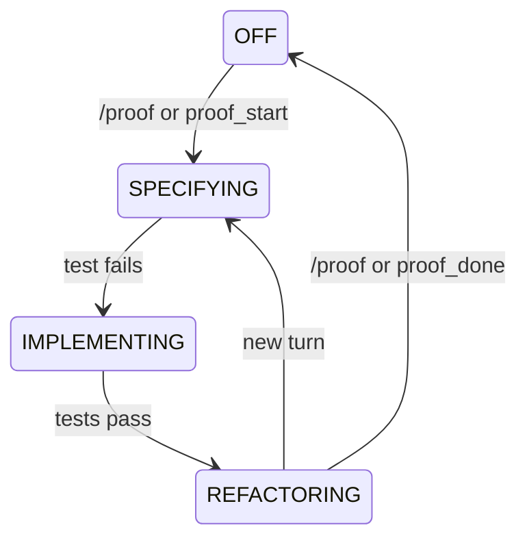

# agent-booster-pack-proof

A proof-first extension for [Pi](https://pi.dev), the terminal coding agent.

It nudges the agent into a red-green-refactor loop when the next change needs a test. It stays out of the way for docs, config, and exploration.

[](https://github.com/kreek/agent-booster-pack/raw/refs/heads/main/agent-booster-pack-proof/assets/release/demo.mp4)

> **Renamed from `pi-proof`.** The old npm name is deprecated;
> migrate to `agent-booster-pack-proof` for ongoing updates. This package is
> one of four sibling packages in [Agent Booster Pack](https://github.com/kreek/agent-booster-pack);
> install the meta-package `agent-booster-pack` for the full bundle.

## Install

Install Pi:

```bash
npm install -g @mariozechner/pi-coding-agent
pi
```

Install agent-booster-pack-proof:

```bash
pi install npm:agent-booster-pack-proof
```

If Pi is already running, run `/reload`.

## Use it

Ask the agent to change behavior:

```
Fix the off-by-one error in pagination
```

The agent decides if proof mode fits. If it does, the agent writes a failing test, makes it pass, refactors, and finishes.

Toggle by hand:

```
/proof
```

## When proof mode helps

Reach for it when:

- A bug has a clear failing case.
- A feature adds or changes observable behavior.
- A business rule needs to be locked down before code.

Skip it when:

- You are editing docs, config, manifests, or lockfiles.
- You are scaffolding plumbing.
- You are exploring and the behavior is not settled.

By default the extension is advisory. It tells the agent that proof mode is available. The agent decides. Once on, the loop is strict.

## Why this works

Tests give the agent ground truth. Without it, the agent guesses.

The research backs this up. [TDFlow](https://arxiv.org/abs/2510.23761) (2025) found that human-written acceptance criteria improve agent accuracy by 12–46 points. [AlphaCodium](https://arxiv.org/abs/2401.08500) (2024) raised GPT-4 accuracy from 19% to 44% with a test-execute-fix loop. [Reflexion](https://arxiv.org/abs/2303.11366) (NeurIPS 2023) hit 91% on HumanEval, up from 80%.

Tests document, too. They show the next reader, human or agent, how the system actually behaves.

Without test discipline, agents tend to:

- Implement before specifying behavior.
- Change too much at once.
- Mix features with refactors.
- Declare success from plausibility, not proof.

## How it works

Three phases. Each phase tells the agent what is allowed.



**SPECIFYING.** The agent writes a failing test. Production `write` and `edit` calls are blocked. Test files and config files pass through. A failing test advances to IMPLEMENTING. If the test fails because a module cannot be imported, the agent gets a one-shot allowance to create a minimal stub so the test can load — the allowance clears after the next run.

**IMPLEMENTING.** The agent writes the smallest code that makes the test pass. A passing test advances to REFACTORING.

**REFACTORING.** The agent restructures. Failing tests tell the agent to revert. No new behavior here.

A new turn — not `proof_done` — closes the cycle and returns to SPECIFYING. The cycle counter ticks then.

Phase transitions ride on test results. The extension runs tests after every file write and parses the output. SPECIFYING only advances after it sees a test file written or a manual test run; unrelated failures do not push the phase forward.

Some files skip the loop: configs, lockfiles, docs, scaffolding. The extension recognizes them by path.

## Test integration

The extension finds your test command from what it sees in the project:

| Detected | Runs |
|----------|------|
| `Makefile` with `test` target | `make test` |
| `package.json` with test script | `npm test` |
| `Cargo.toml` | `cargo test` |
| `go.mod` | `go test ./...` |
| `pytest.ini` or `pyproject.toml` | `pytest` |

If it cannot tell, it asks once.

It recognizes test files by name: `*.test.*`, `*.spec.*`, `*_test.*`, `*_spec.*`, plus files under `__tests__/` or `test/`.

It parses output from:

| Language | Frameworks |
|----------|-----------|
| JS/TS | Jest, Vitest, Mocha, Bun, AVA |
| Python | pytest, unittest |
| Go | go test |
| Rust | cargo test |
| Ruby | RSpec, Minitest |
| Java/Kotlin | Gradle; JUnit/Maven (summary) |
| C# | dotnet test |
| Swift | XCTest, Swift Testing |
| PHP | PHPUnit, Pest |
| Elixir | ExUnit |
| Universal | TAP |

When per-test lines aren't found, the parser falls back to summary regex. Parsed results show in the tool result and in the HUD.

## HUD

When proof mode is on, a widget shows:

- The phase, color-coded.
- The cycle count.
- Passed, failed, duration.
- Up to seven test results, with an overflow indicator.

It updates after each test run.

## Tools

| Interface | What it does |
|-----------|--------------|
| `proof_start` | Agent tool. Enters proof mode. |
| `proof_done` | Agent tool. Exits proof mode. |
| `/proof` | Slash command. Manual toggle. |

The legacy `tdd_start`, `tdd_done`, and `/tdd` still work.

## Limits

This extension enforces the loop, not the quality of the tests.

- Shallow user stories give shallow confidence.
- Proof mode is opt-in per task. The extension does not force it on every change.
- Only SPECIFYING blocks writes. IMPLEMENTING and REFACTORING steer through prompts.
- Shell-based production writes during SPECIFYING are warned, not blocked.
- The import-only stub allowance lets SPECIFYING produce a minimal production stub when the test file cannot load.
- A new turn closes the cycle, not `proof_done`. A long turn can stay in REFACTORING across many writes.
- No state between sessions.
- No LLM review. The extension trusts the test runner.

## Development

```bash
git clone git@github.com:kreek/agent-booster-pack.git
cd agent-booster-pack/agent-booster-pack-proof
npm install
npm run install-hooks
npm test
```

The pre-commit hook runs `biome check --staged`.

```
src/
  index.ts        Extension entry, phase machine, HUD, tools
  parsers.ts      Test output parsers (13 frameworks)
test/
  parsers.test.ts Parser tests
```

To add a parser, append a `TestLineParser` to `defaultParsers` in `src/parsers.ts`. For development installs from a local checkout, `npm run install-ext` symlinks the repo into `~/.pi/agent/extensions/agent-booster-pack-proof`.

## Eval

The extension ships with an eval harness built on [pi-do-eval](https://github.com/kreek/pi-do-eval). It runs Pi with agent-booster-pack-proof loaded against small coding projects and scores proof-first compliance, test quality, and correctness.

```bash
cd eval
npm install
npm run eval -- list                                          # list trials, variants, suites
npm run eval -- run small                                     # fast regression
npm run eval -- run --trial temp-api --variant typescript-vitest
npm run view                                                  # http://localhost:3333
npm run eval -- regress small                                 # compare against previous run
```

`small` is for day-to-day changes. `full` is for releases.

Suites run serially. `--concurrency` opts into parallel runs, but the harness refuses values above 1 when the worker or judge provider is subscription-backed.

## License

MIT
